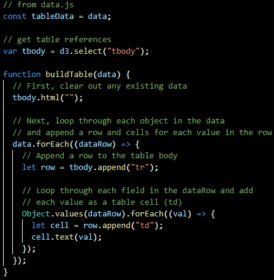
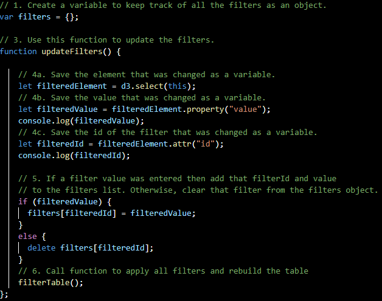
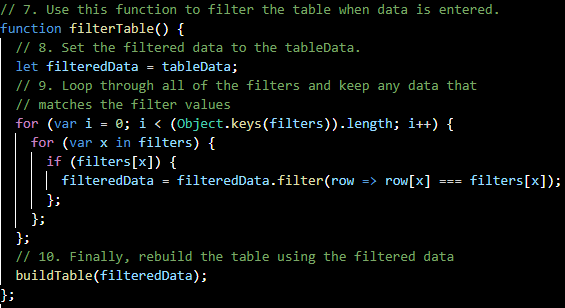
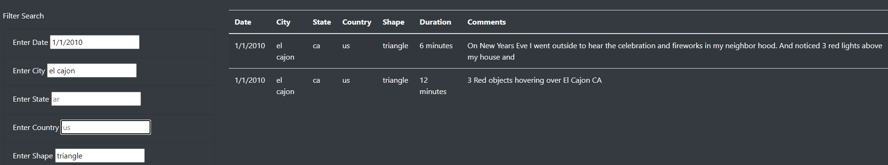
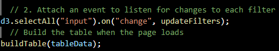

# Constructing A Web App For Presenting UFO Sighting Data

### *Files*:
- HTML File: [index](index.html)
- JavaScript App File: [app](static/js/app.js)
- Data File:[data](static/js/data.js)

## **Project Overview**:
The purpose of this project was to use JavaScript and HTML to create a web app related to instances of UFO sightings that is both aesthetically pleasing and responsive to user inputs. A colleague named Dana was interested in creating a web page using JavaScript code and wanted to have the focus be on UFO sightings since 2010. By coding the page's actions in a JavaScript file and using an HTML file to present the scripts, the final product would present an information section and a filterable table of sighting events listed in a data file. The events can be filtered through five different parameters to narrow the results down significantly for very specific criteria relating to the date, location and nature of the observations.

## **Analysis**:
The search criteria relating to this web page can filter on five different parameters including: date of observation, city where the sighting was reported from, the state each city is located in, the country that the city and state are located in, and the shape of the object(s) sighted. Each input into the search filters will narrow the displayed sights presented in the table on the web page, with the minimum possible sightings that can be returned in the table being none. The basic concepts involved in the JavaScript are applied on three levels:

- The most basic form of the web page is presented with the data provided in the data.js file being iterated through and used to populate cells in the table seen in the page's initial form before any search parameters are entered. The code for creating the table itself is presented in the screenshot below:

The code first imports the data from the data file and reads each row into a table body tag in the HTML file using a "forEach" function. It then populates the values for each cell with a "forEach" function nested inside the previous function and presents those cells by rows.

- Following the construction of the table, the filters are created and applied in two different functions with one calling the other at the end of it's execution. The code for the filters is shown in the screenshot below:

Before the functions are presented, an empty object "filters" is declared outside of the functions to hold the filter parameters and have them be reset with each input change in the filter search section. These functions first gather and interpret the user's inputs with the "d3.select(this);" line and breaks the aspects of the input down into the element, value and attribute parts. An "if/else" loop is then applied to populate the empty "filters" object and ensure the entry "id" has a usable "value" pair for the filter section's parameter and the value entered by the user in the web page's input box. After the "if/else" loop is run, the function then calls on a second function to process the data in data.js based on the parameters provided in the first function.

- The second function's code is provided below:

This function sets the table data without filters equal to the newly defined filtered data variable and uses an "if" loop nested in two "for" loops to ensure the returned data only matches cases with the "filters" object's key/value pair. By iterating through the "filters" object based on its length, the keys of the object are iterated through and given a conditional case where they are added to the "filteredData" object only if they match the "filters" object's key/value pair. The table is then reconstructed with the same function that constructed it without the filtering parameters.

For the web page user to filter the data on their end, accurate entries of what data is available are needed but the table responds immediately with each entry as shown below:

- Filtering based on the City's name:

- Filtering based on the shape observed:

- Filtering based on date, city and shape:

- The final section of the JavaScript is the event listening section that detects any input as a change to the filters and runs the functions again for each change that is detected. The final part is the line responsible for the inital table's construction without any applied filters. This section is included in the screenshot below:

## **Summary**:
This web page is an example of how useful JavaScript can be for presenting data in an engaging and user-friendly way. It is worth noting, however, that this web page has aspects that are lacking while still being an effective way of presenting the data. One of the biggest drawbacks with this web page is with the code's structure, the presented data must match the search criteria and cannot provide simultaneous search instances for comparison among them. Since the code's functions are designed to clear the search parameters with each execution, the ability to compare searches such as two specific cities at once or all cases of circles and triangles observed is limited only to carryout multiple searches and losing the filtered data with each change.

Based on the noted limitations in the section above, two recommendations can be suggested for further improvements on the web app's presentation of the data.
- 1.) The table could implement buttons to present the data in a new form based on either ascending or descending values for whichever column's button was activated. By implementing this option and not reducing the available data, comparisons could be drawn much more easily without needing to scroll through the list multiple times.
- 2.) One of the biggest improvements would be to include the option to search for a pair or multiple entries in a single parameter, as mentioned above, such as two different cities in the filter section or two different states in formats either separated by a comma or presented in brackets.

